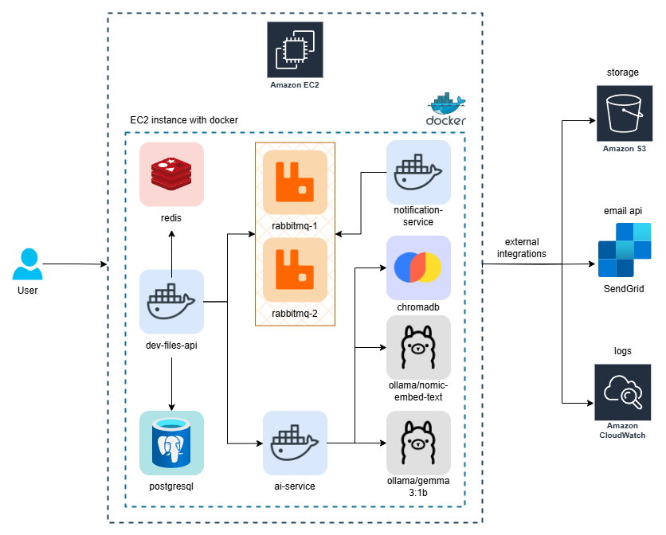
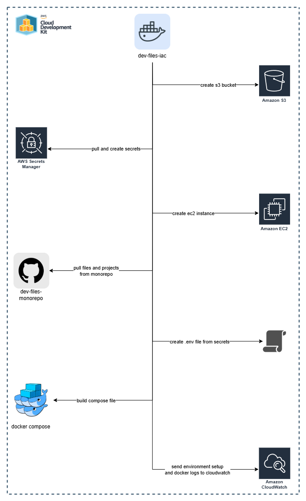

# Dev Files Monorepo

> **Study project developed for learning purposes.**

Monorepo that contains all microservices and infrastructure for the **DevFiles** project.

This repository is designed to be deployed on a single AWS EC2 instance, utilizing Docker containers for each microservice.

## Open ports

The following ports are exposed for the DevFiles application:

- **22**: SSH access to the EC2 instance.
- **80**: HTTP traffic for the dev-files-api service.
- **15672**: RabbitMQ management interface.
- **6379**: Redis cache.
- **8000**: ChromaDB vector database.
- **5432**: PostgreSQL database.

## Prerequisites

- **AWS Account**: Required for deploying the application on AWS.
- **Secrets Manager**: AWS Credentials and Mail Sender configuration should be stored in AWS Secrets Manager.

## Features

- **User Management**: Create and manage users.
- **File Management**: Upload, download, and manage files.
- **AI Integration**: Use AI models for file processing and query handling.
- **Notifications**: Email notifications for user actions.

#  Architecture Overview

**DevFiles** system runs on a single AWS EC2 instance and consists of multiple Dockerized microservices designed to work together as a cohesive backend platform.

## Microservices
- **dev-files-api**: RESTful API, responsible for handling user requests, creating and managing users and files and orchestrating services like AI and notification.
- **ai-service**: RAG (Retrieval-Augmented Generation) service that processes user files and queries using AI models.
- **notification-service**: Listens to RabbitMQ queues and sends email notifications with SendGrid.

## Infrastructure Components
- **PostgreSQL**: Main relational database for persistent application data.
- **Redis**: Temporary caching layer used by the API and locking mechanism for file processing.
- **RabbitMQ**: Two-node message broker with quorums queues for reliable message delivery and asynchronous communication between dev-files-api and notification-service.
- **ChromaDB**: A vector database for storing and retrieving embeddings.
- **Ollama LLMs**: Two locally hosted models: `gemma:3b` (conversational) and `nomic-embed-text` (embedding).

## Deployment and Orchestration
- **EC2**: The AWS EC2 instance that hosts all the Docker containers.
- **Docker Compose**: Used to manage and orchestrate all the microservices and their dependencies.
- **S3**: AWS S3 bucket used for file uploads and storage.
- **CloudWatch**: Centralized logging for all services within EC2.
- **Secrets Manager**: Manages sensitive information like API keys and database credentials.
- **SendGrid**: Email service used for sending notifications.
- **GitHub Actions**: CI/CD pipeline for building, testing, and deploying the application.

All services are orchestrated using Docker Compose, allowing for isolated, containerized deployments inside the EC2 instance.

# Architecture and Infrastructure Diagrams

Architecture and infrastructure diagrams provide a visual representation of the DevFiles system, illustrating how the various components interact with each other and the AWS infrastructure.

## Architecture Diagram
This diagram illustrates the overall architecture of the DevFiles application, showing how the microservices interact with each other and the infrastructure components.



## Infrastructure as Code (IaC)
This project uses AWS CloudFormation for Infrastructure as Code (IaC) to define and provision the AWS resources required for the DevFiles application.

### Breakdown of IaC Flow

1. **Create S3 Bucket**: For file storage.
2. **Pull External Secrets from Secrets Manager**: Retrieves AWS credentials and mail sender configuration.
3. **Create Secrets in Secrets Manager**: Stores sensitive information like API keys and database credentials.
4. **Create EC2 Instance**: The main compute resource that runs all Docker containers.
5. **Run User Data Script**: Initializes the EC2 instance with Docker and Docker Compose, pulls the latest code from GitHub, creates .env file, create cloudwatch log group, and starts the Docker Compose stack.

### IaC Diagram



# Running Locally

To run the DevFiles application locally, follow these steps:

1. **Clone the Repository**:
```bash
git clone --recurse-submodules https://github.com/bccalegari/dev-files-monorepo.git
```

2. **Navigate to the Project Directory**:
```bash
cd dev-files-monorepo
```

3. **Create a `.env` File**:
```bash
cp .env.example .env
```
Create a `.env` file in the root directory with the necessary environment variables. You can use the `.env.example` file as a reference.


4. **Start the Application**:
```bash
docker-compose up
```

---

> **Study project developed for learning purposes.**

Built with ❤️ by Bruno Calegari